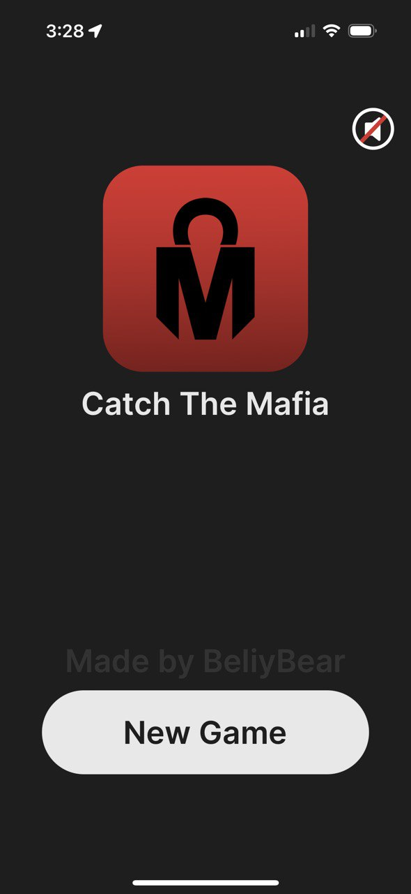
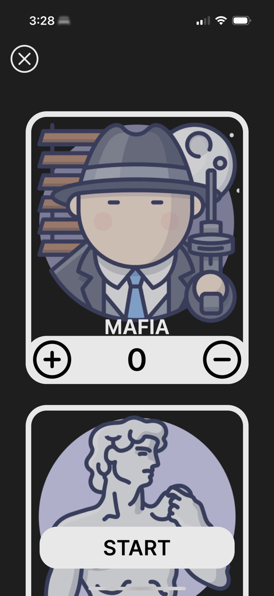
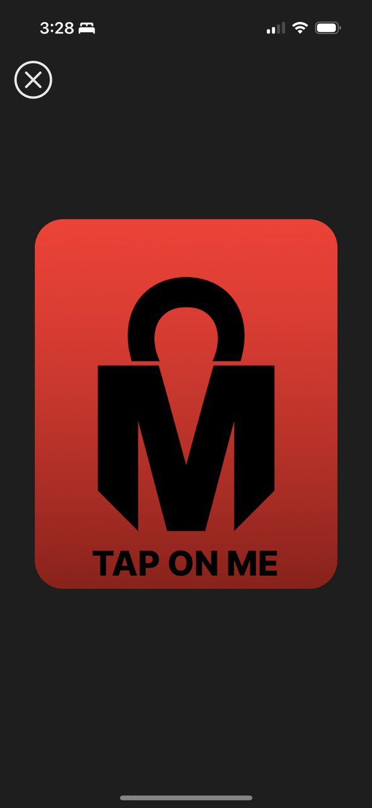
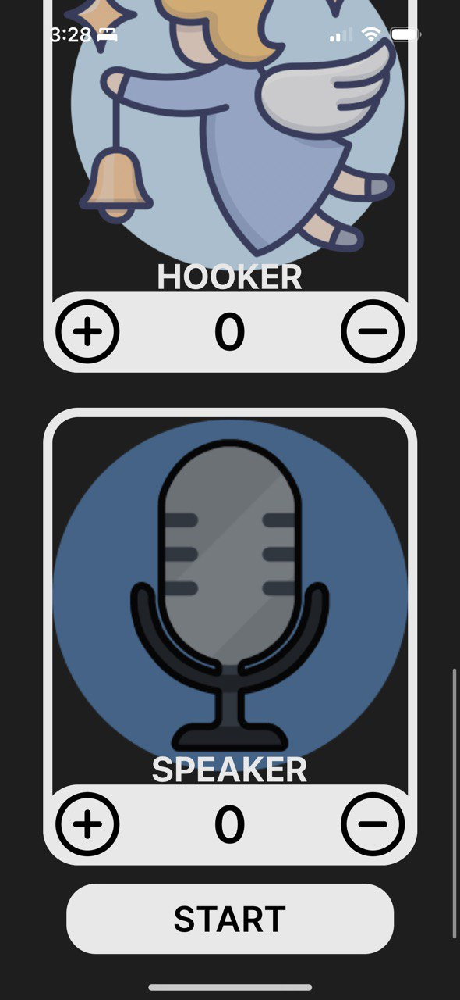
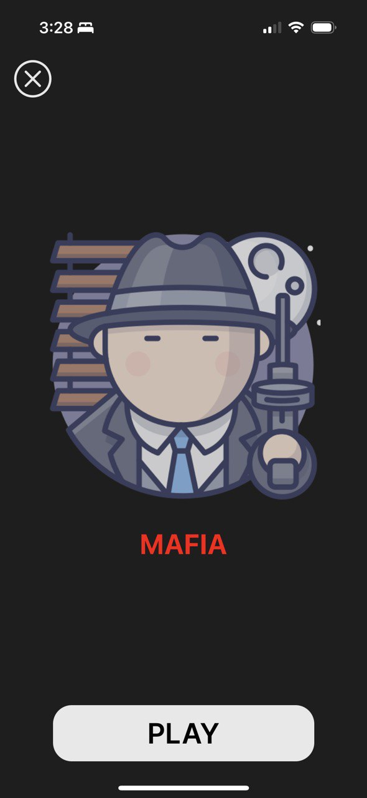
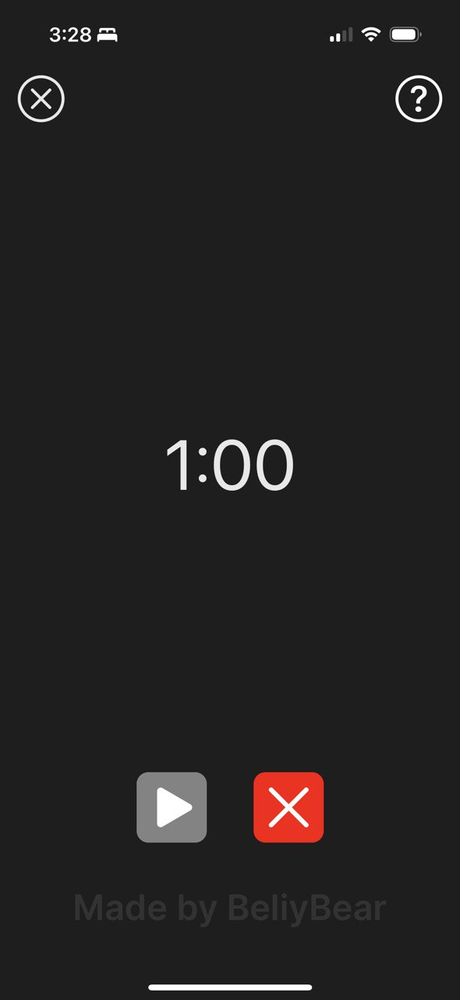

# Catch The Mafia

A mafia card game for 3-30 players.

## Technical Specifications

The application is universal and supports iOS 13.0+.

The codebase is currently on Swift 5.7

## Contributing

Role Contribution:

If you have ideas that you are interested in adding to the game, feel free to contact me directly at ianbelyakov@gmail.com.

## License

The codebase is shared under the MIT License. Copyright (c) Ian Belyakov 2022-2023. All Rights Reserved. Redistribution of the codebase in any form commercially is strictly forbidden.

## Screenshots

